# Dex_Uni: In-Hand Dice Reorientation with Reinforcement Learning

Train a **Unitree Dex3-1** robotic hand (3-finger, 7 DOF) to reorient a dice in-hand to show any target face (1-6) on top, using Proximal Policy Optimization (PPO) in MuJoCo simulation.

<p align="center">
  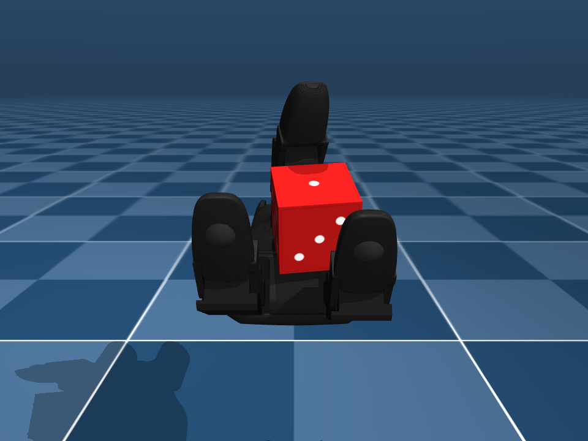
  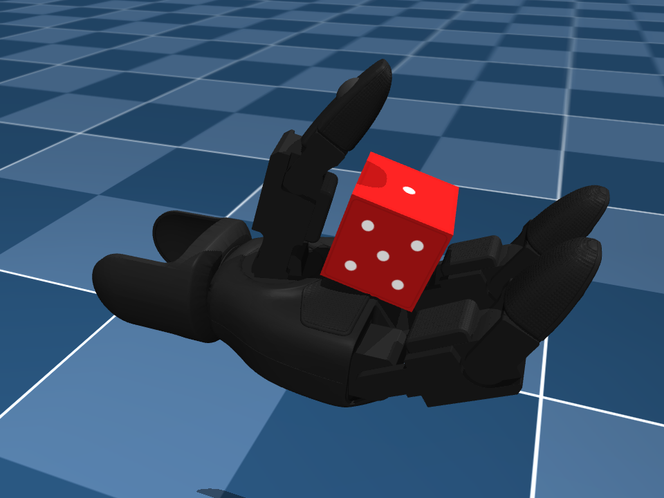
  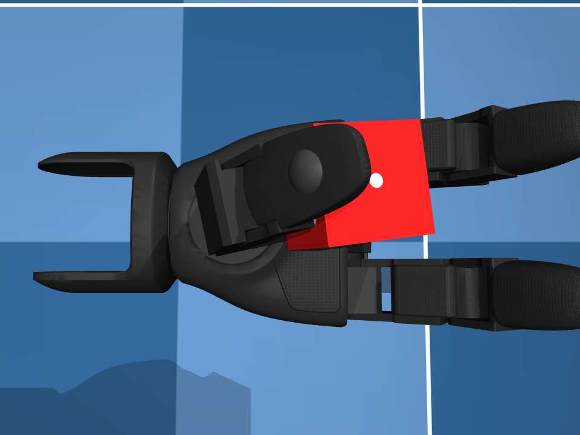
</p>
<p align="center"><em>Dex3-1 hand grasping a dice with three-finger precision grip</em></p>

---

## Overview

This project implements a complete RL pipeline for dexterous in-hand manipulation:

- **Hand Model**: Unitree Dex3-1 right hand extracted from [mujoco_menagerie](https://github.com/google-deepmind/mujoco_menagerie), with 3 fingers (thumb, middle, index) and 7 actuated joints
- **Task**: Reorient a standard dice (opposite faces sum to 7) to show a user-specified face on top
- **Algorithm**: Custom PPO implementation in PyTorch with multi-phase curriculum learning
- **Simulation**: MuJoCo (CPU) with 256 parallel environments
- **Control**: Native position actuators with residual action space (action = 0 holds the grip)

### The Hand

<p align="center">
  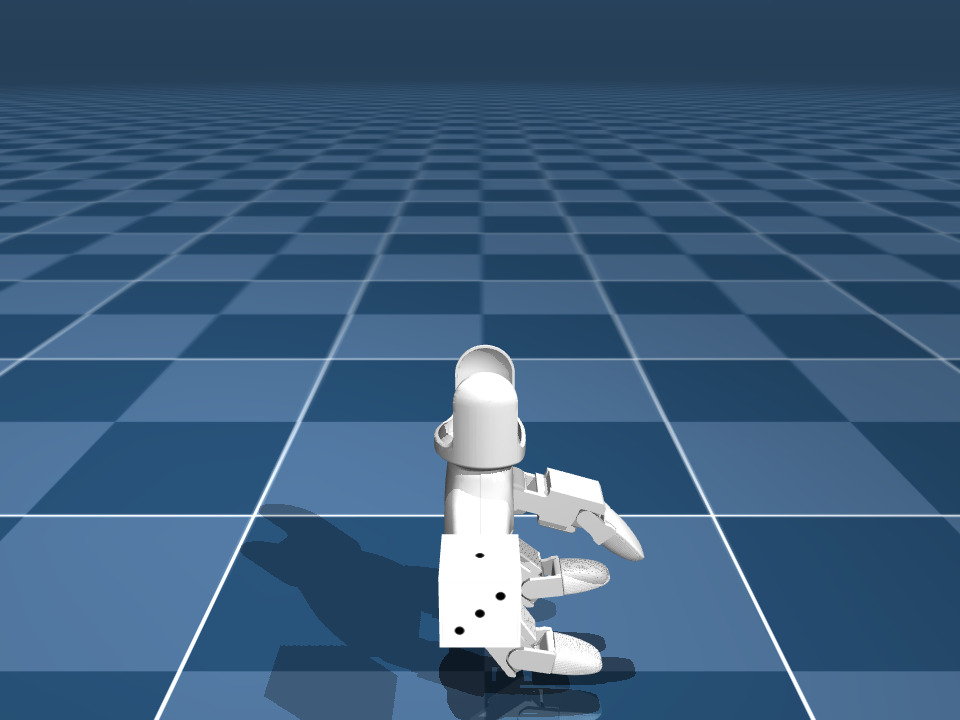
  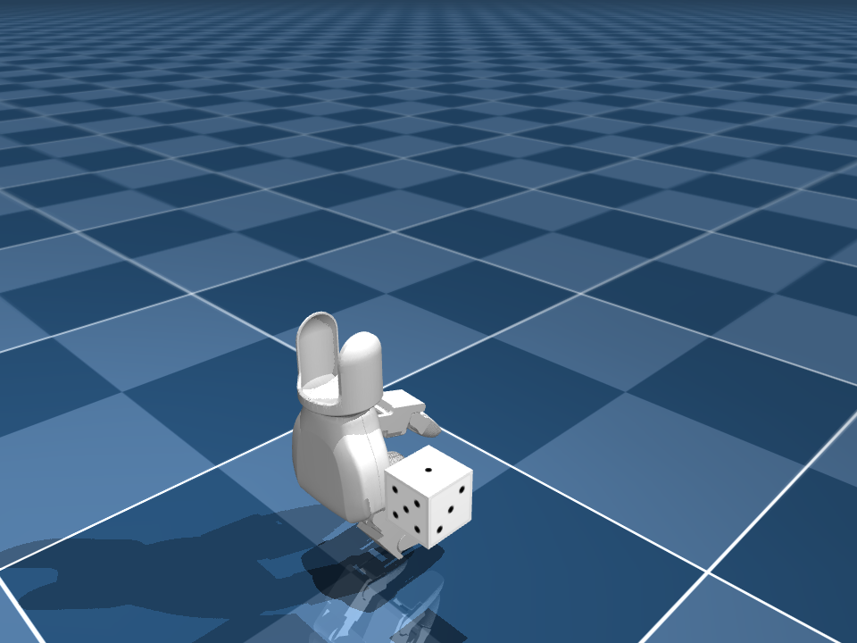
  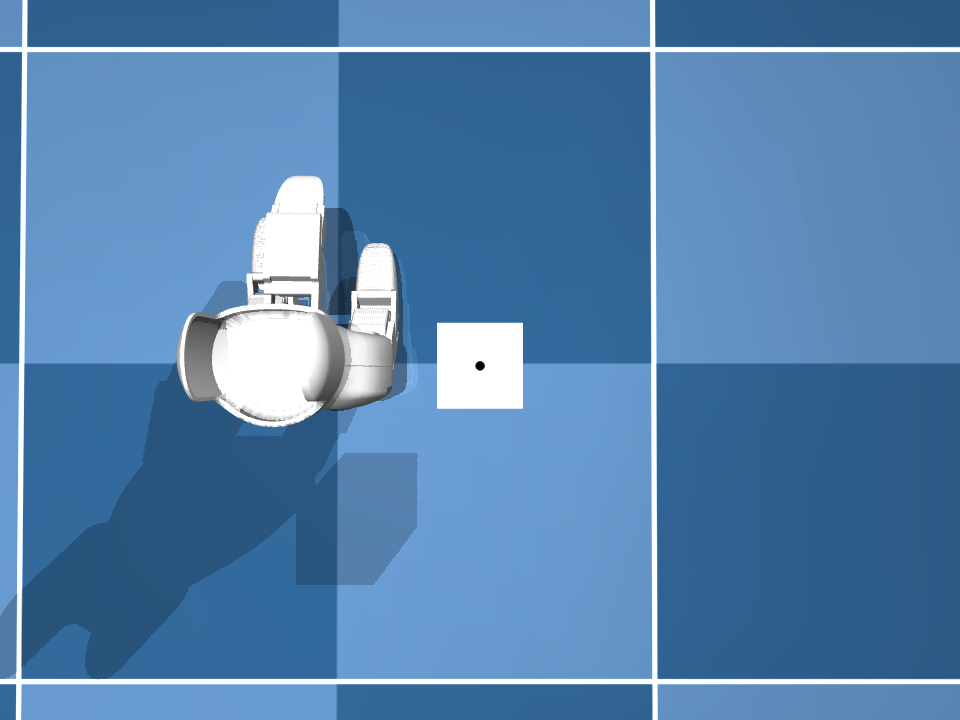
  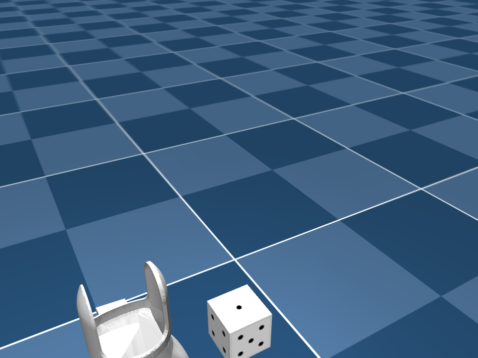
</p>
<p align="center"><em>Dex3-1 hand: front, side, top, and scene overview</em></p>

### Grasping the Cube

<p align="center">
  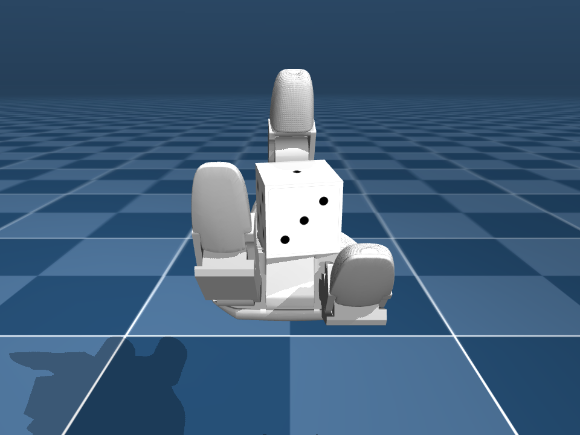
  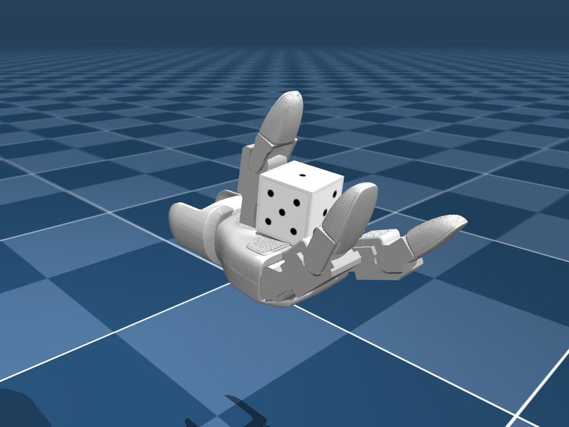
  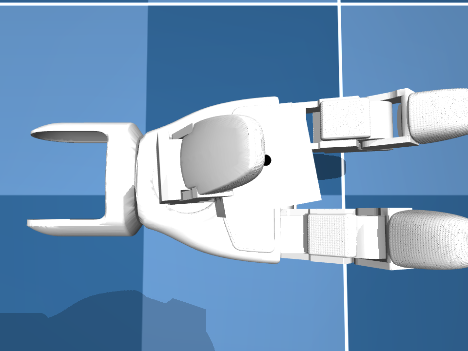
</p>
<p align="center"><em>Palm-up grasp configuration from multiple angles</em></p>

<p align="center">
  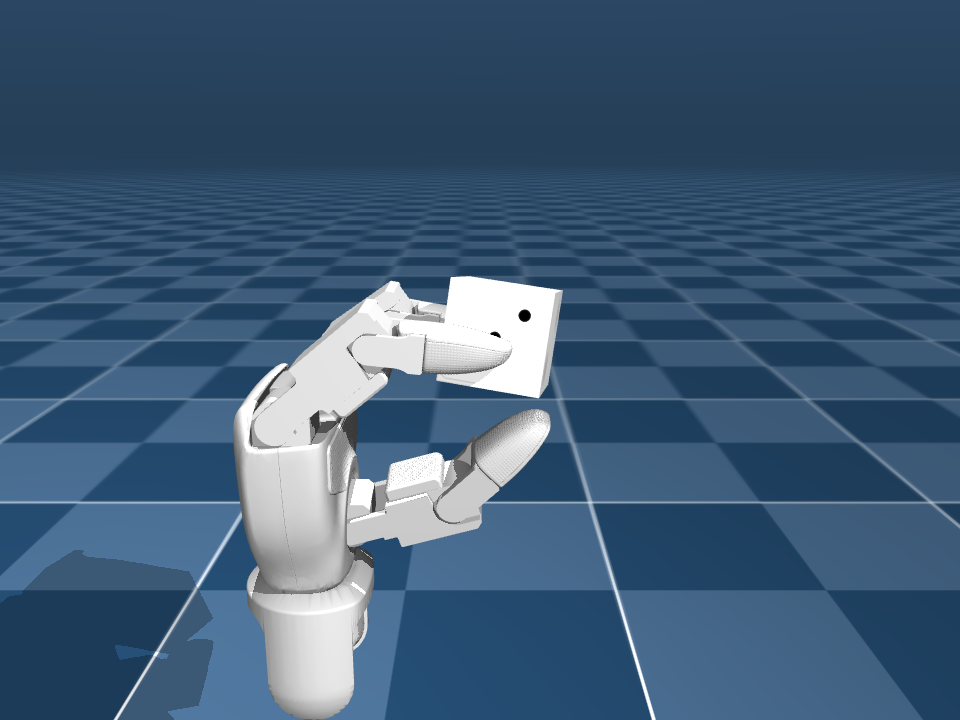
  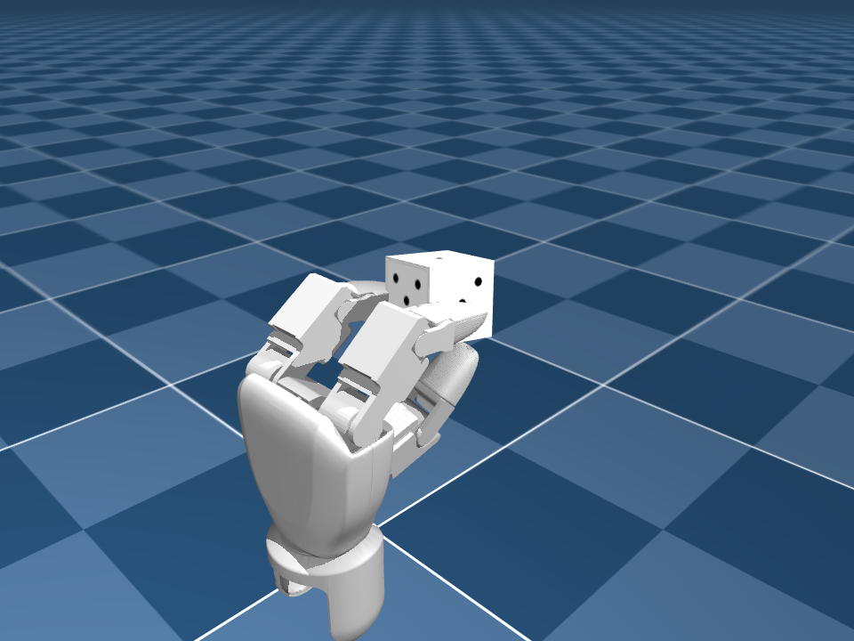
</p>
<p align="center"><em>Fixed grasp with cube held between three fingers</em></p>

---

## Project Structure

```
Dex_Uni/
├── configs/                        # Training configurations (YAML)
│   └── ppo_v2_runpod.yaml         # Current config: 9-phase curriculum, 256 envs
│
├── envs/                           # Environment implementations
│   ├── dex_cube_env.py             # Single-env MuJoCo environment (obs_dim=48, act_dim=7)
│   ├── vec_env.py                  # CPU SubprocVecEnv (multiprocessing, auto-reset)
│   └── reward.py                   # Reward: distance + progress + gait + contact + smooth
│
├── rl/                             # Reinforcement learning components
│   ├── ppo.py                      # PPO with value clipping, obs/reward normalization
│   ├── actor_critic.py             # Actor-Critic network (512-256-128, tanh)
│   └── buffer.py                   # Rollout buffer with per-env GAE
│
├── training/                       # Training scripts
│   ├── train_parallel.py           # CPU parallel training with 9-phase curriculum
│   └── evaluate.py                 # Per-face evaluation + video recording
│
├── perception/                     # Dice state detection
│   └── face_detector.py            # Geometric face detection + target quaternions
│
├── ui/                             # Visualization
│   ├── viewer.py                   # Interactive MuJoCo viewer (press 1-6 for faces)
│   └── viewer_cpu.py               # CPU-only viewer
│
├── models/                         # MuJoCo XML models
│   ├── dex3_dice_scene_torque.xml  # Position actuators, mesh collisions, kp=50
│   └── dex3_assets/                # STL meshes + dice OBJ + texture
│
├── scripts/                        # Utility & verification scripts
│   ├── smoke_test_training.py      # Pipeline smoke test (all 9 phases)
│   ├── test_manipulation.py        # Physics pipeline verification
│   ├── diagnose_hand.py            # Hand diagnostics
│   └── sweep_grip.py               # Grip parameter sweep
│
└── assets/                         # Images and resources
    └── *.png                       # Screenshots for documentation
```

---

## Approach

### Observation Space (48 dimensions)

| Component | Dims | Description |
|-----------|------|-------------|
| Joint positions | 7 | Hand joint angles |
| Joint velocities | 7 | Hand joint angular velocities |
| Relative cube position | 3 | Cube position relative to palm |
| Cube quaternion | 4 | Current dice orientation [w,x,y,z] |
| Cube angular velocity | 3 | Dice rotation rate |
| Target quaternion | 4 | Desired orientation for target face |
| Fingertip positions | 9 | 3D position of each fingertip (3x3) |
| Current face | 1 | Which face is currently on top (normalized) |
| Previous action | 7 | Last action taken (for smoothing) |
| Contact forces | 3 | Per-finger contact strength with dice |

### Action Space (7 dimensions)

Residual position offsets applied to a pre-tuned grip configuration:

```
ctrl = grip_qpos + action * action_scale
```

- `action = 0` holds the dice at the default grip position
- `action_scale = 0.25 rad` (reduced in early curriculum phases: 0.08 → 0.15 → 0.25)
- Native MuJoCo position actuators (`kp=50, dampratio=1`), per-joint forcerange: thumb_0 ±2.45 Nm, all others ±1.4 Nm

### Reward Design

The reward function combines continuous shaping with sparse task completion signals:

| Component | Formula | Purpose |
|-----------|---------|---------|
| Distance | `-quat_distance * scale` | Potential-based shaping toward target |
| Progress | `(prev_dist - curr_dist) * 15.0` | Directional signal for improvement |
| Goal bonus | `+100.0` (one-time) | Sparse reward for reaching target |
| Drop penalty | `-50.0` | Penalize losing the cube |
| Contact bonus | `+0.1` (3 fingers), `+0.05` (2) | Encourage stable grip |
| Gait lift | `+0.5` when finger lifts with 2 holding | Encourage finger gaiting |
| Gait replace | `+0.3` when finger re-contacts | Complete the gait cycle |
| Action smooth | `-0.02 * \|\|a - a_prev\|\|^2` | Penalize jittery actions |
| Hold bonus | `+0.05` (3 contact + low angvel) | Reward stable states |

**Finger gaiting**: Bioinspired approach where 2 fingers hold the object while 1 lifts, repositions, and re-engages. A cooldown timer (5 steps) prevents reward hacking through rapid cycling.

### Curriculum Learning (9 Phases)

Training progresses through graduated difficulty levels. Each phase controls its own exploration noise (log_std bounds), entropy bonus, episode length, action scale, and reward weights. Phases advance only when **eval success rate** (not training SR) exceeds the threshold, with minimum update counts to prevent premature advancement.

| Phase | Task | Start → Target | Advance SR |
|-------|------|----------------|------------|
| 1. GRIP | Hold cube stable | angle(0.0) → [1] | 95% |
| 2. MICRO_ROTATE | Tiny rotations (~17 deg) | angle(0.3) → [1] | 70% |
| 3. GAIT_EMERGE | Medium rotations, gaiting begins | angle(0.8) → [1] | 45% |
| 4. MED_ROT | Half rotations (~90 deg) | angle(1.57) → [1] | 35% |
| 5. SINGLE_90 | Full rotation, one start face | [2] → [1] | 30% |
| 6. MULTI_90 | Full rotation, all start faces | [2,3,4,5,6] → [1] | 40% |
| 7. MULTI_TARGET | Introduce non-face-1 targets | [1-6] → [1,2,6] | 30% |
| 8. EXPAND_TARGET | All 36 transitions (warm-up) | [1-6] → [1-6] | 25% |
| 9. ALL_FACES | Any face to any face (terminal) | [1-6] → [1-6] | 80% |

Key design decisions:
- **Phases 1-6** only target face 1, building rotation skills incrementally
- **Phase 7** introduces 2 new target faces (face 2 and face 6) for the first time — 18 transitions
- **Phase 8** expands to all 36 transitions at a low threshold, warming up the policy before the terminal phase
- **Phase 9** is the terminal phase requiring 80% SR across all faces with 1500 minimum updates

### Dice Face Mapping

```
Face 1: +Z (top)      Face 6: -Z (bottom)     (opposite faces sum to 7)
Face 2: +Y (front)    Face 5: -Y (back)
Face 3: +X (right)    Face 4: -X (left)
```

<p align="center">
  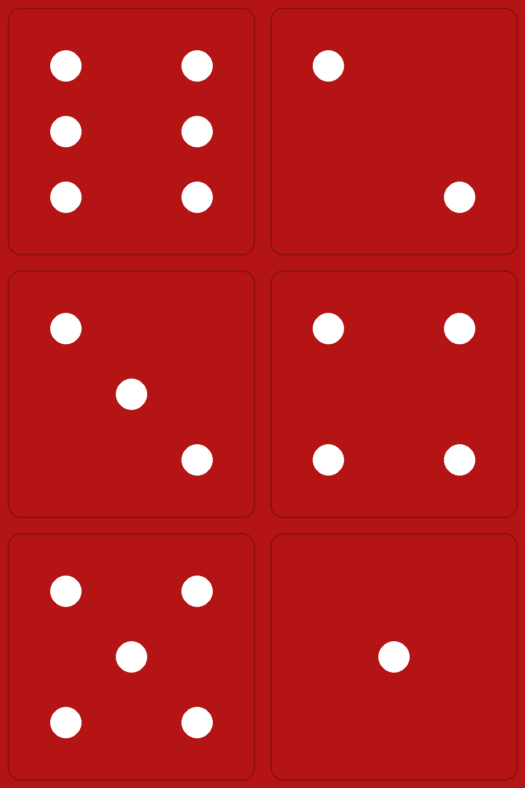
</p>
<p align="center"><em>UV-mapped dice texture (standard layout)</em></p>

---

## Training

### CPU Parallel Training (Current)

Trains on CPU MuJoCo with SubprocVecEnv and 256 parallel environments:

```bash
python training/train_parallel.py --config configs/ppo_v2_runpod.yaml
```

- **Hardware**: RunPod cloud GPU instance (CPU training, GPU optional for PyTorch)
- **Data**: 16,384 transitions per update (256 envs x 64 rollout steps)
- **Curriculum**: 9-phase progression from grip stability to all-face reorientation
- **PPO**: Per-minibatch advantage normalization, reward normalization, KL early stopping

### Resume Training

```bash
python training/train_parallel.py --config configs/ppo_v2_runpod.yaml --resume checkpoints/ppo_update_1000.pt --start_phase 3
```

### Smoke Test (verify pipeline)

```bash
python scripts/smoke_test_training.py --config configs/ppo_v2_runpod.yaml
```

Runs 8 envs with 3 updates per phase — verifies all 9 phases work without crashes, NaN, or invalid rewards.

---

## Evaluation

Run per-face evaluation on CPU MuJoCo:

```bash
python training/evaluate.py --checkpoint checkpoints/best_eval_model.pt --config configs/ppo_v2_runpod.yaml
```

Output:
```
  Face   Success%     Mean R   Mean Len      Drop%
--------------------------------------------------
     1      100.0%      95.20       12.3       0.0%
     2       98.0%      89.50       18.1       0.0%
     ...
   ALL       99.2%      91.30
```

---

## Interactive Viewer

Launch the MuJoCo viewer with a trained policy:

```bash
python ui/viewer_cpu.py --checkpoint checkpoints/best_eval_model.pt --config configs/ppo_v2_runpod.yaml
```

**Controls**:
- Press **1-6** to command dice reorientation to that face
- The policy runs in real-time, rotating the dice to show the target face on top

---

## Key Technical Details

### Position Actuators

MuJoCo's native position actuators handle PD control internally, providing stable control for RL:

```xml
<actuator>
  <position name="thumb_0_act" joint="thumb_0" kp="50" dampratio="1" forcerange="-2.45 2.45"/>
  <position name="thumb_1_act" joint="thumb_1" kp="50" dampratio="1" forcerange="-1.4 1.4"/>
  <!-- ... per-joint forcerange from Unitree menagerie specs -->
</actuator>
```

### Quaternion Distance

Orientation error uses quaternion distance with double-cover handling:

```python
def quat_distance(q1, q2):
    return 1.0 - abs(dot(q1, q2))  # range [0, 1]
```

### Grip Configuration

Pre-tuned joint positions that form a stable three-finger cradle:

```python
grip_qpos = [-0.5, -0.4, -1.2, 0.85, 0.8, 0.85, 0.8]
```

Reset uses a 3-phase sequence: 300-step close (kinematic hold) + 100-step gradual release (ramp down support force) + 300-step settle (free dynamics).

---

## Results

### v1: MJX Training (GPU, 2048 envs)

- All 7 curriculum phases completed
- **100% eval success rate** on all 6 target faces in MJX physics
- 262M timesteps, ~8.3 hours on RTX 4090
- 0% drop rate throughout training
- **However**: MJX→CPU transfer gap of ~76% (100% MJX → 24% CPU) due to collision geometry mismatch (primitives vs meshes). MJX approach abandoned.

### v2: CPU Training (256 envs) — In Progress

The v2 pipeline trains directly on CPU MuJoCo with mesh collisions, avoiding the sim-to-sim transfer gap entirely:

- **9-phase curriculum** with gradual introduction of target faces
- **256 parallel envs** providing 16,384 transitions per update
- **PPO fixes**: per-minibatch advantage normalization, reward normalization, KL early stopping
- **Reward audit**: drop_penalty calibrated to prevent perverse drop incentives
- **Smoke test**: all 9 phases verified — no NaN, valid rewards, finite losses
- **Status**: pipeline ready, clean-slate retrain pending on RunPod

### v1 CPU Training Peak (reference)

- Peak eval SR: 94.1% (update ~8000), final: 80.9% at update 15000
- F3 oscillation due to catastrophic interference in multi-task RL
- Motivated the v2 pipeline overhaul with 9-phase curriculum

---

## Current Status — To Be Continued

The v2 pipeline is fully audited and verified. The immediate next step is a **clean-slate retrain** on RunPod with the 9-phase curriculum:

```bash
python training/train_parallel.py --config configs/ppo_v2_runpod.yaml
```

**What's ready:**
- 9-phase curriculum with smooth target face introduction
- 256 parallel CPU environments (16K transitions/update)
- PPO with per-minibatch advantage normalization, reward normalization, KL early stopping
- Calibrated actuators matching Unitree menagerie specs (kp=50, per-joint forcerange)
- Calibrated dice physics (correct inertia, torsional friction)
- Drop penalty tuned to prevent perverse incentives in later phases
- Smoke test passing all 9 phases

**Target:** 80%+ eval success rate across all 6 faces on CPU MuJoCo with mesh collisions.

---

## Future Scope

This project establishes a strong baseline with PPO but opens the door to more expressive policy representations. The following directions are planned:

### Diffusion Policy (DP)

Replace the unimodal Gaussian policy with a **diffusion-based policy** that generates actions through iterative denoising. Dexterous manipulation is inherently multimodal - there are multiple valid finger coordination strategies for the same reorientation goal (e.g., rolling along the X-axis vs. Y-axis to reach the same target face). A Gaussian policy is forced to average over these modes, producing suboptimal "compromise" actions. Diffusion policies can capture the full distribution of viable strategies, selecting one coherent mode per rollout.

**Why it matters for this task**:
- The 36 face-to-face transitions (6 start x 6 target) have geometrically distinct optimal trajectories
- Finger gaiting requires temporally coordinated lift-hold-replace sequences - a multimodal action space naturally represents different gaiting patterns
- Contact-rich manipulation benefits from the smoother, more structured action sequences that diffusion models produce

### DPPO (Diffusion Policy Policy Optimization)

**DPPO** combines diffusion policy representations with PPO-style policy gradient fine-tuning. Instead of training the diffusion policy purely from demonstrations (behavior cloning), DPPO enables direct optimization against the reward signal from simulation. This is particularly relevant here because:

- **No demonstrations needed**: The current pipeline is fully self-play RL - there are no human demonstrations for this specific hand morphology. DPPO can fine-tune a diffusion policy entirely from reward, matching the existing training paradigm.
- **Sim-to-sim transfer**: A diffusion policy's richer action distribution may generalize better across physics backends (MJX vs. CPU MuJoCo), potentially closing the 100% -> 24% transfer gap that domain randomization alone could not resolve.
- **Curriculum compatibility**: DPPO can integrate with the existing 9-phase curriculum - train a diffusion policy through progressive difficulty stages, with the denoising process adapting to each phase's reward structure.

### Planned Architecture

```
Current:    obs(48) -> MLP(512,256,128) -> Gaussian(mean, std) -> action(7)
Proposed:   obs(48) -> MLP(512,256,128) -> Diffusion(T=20 denoise steps) -> action(7)
```

The diffusion policy would use the same observation space (48-dim) and action space (7-dim residual positions), making it a drop-in replacement for the current actor network while preserving the critic, buffer, and curriculum infrastructure.

### Other Directions

- **Sim-to-Real Transfer**: Deploy trained policies on physical Unitree Dex3-1 hardware with real-time inference
- **Multi-Object Generalization**: Extend beyond dice to arbitrary convex objects (spheres, cylinders, irregular shapes)
- **Tactile Sensing Integration**: Incorporate contact force feedback from simulated tactile sensors for closed-loop manipulation
- **Hierarchical Policies**: High-level planner selects rotation axis, low-level controller executes finger gaiting sequences

---

## Challenges Faced

Building an end-to-end RL pipeline for dexterous manipulation surfaced several non-obvious problems. These are documented here for anyone attempting similar work.

### Actuator Instability

The original MJCF model used **torque actuators**, which caused the hand to jitter uncontrollably - the policy couldn't learn stable grasps. Switching to **native position actuators** (`kp=5, dampratio=1`) with a residual action space (`ctrl = grip_qpos + action * scale`) was the critical fix. With `action = 0` the hand holds the dice stably, giving the policy a safe default to learn from.

### Evaluation Bias

The initial evaluation function ran 64 parallel envs with mixed target faces and counted the **first 20 episodes to finish**. This created a severe selection bias: successful episodes terminate early (goal reached), so they were overrepresented. The metric showed **100% success rate** while the true per-face rate was **33-40%**. The fix was `evaluate_per_face()` - run exactly N episodes per face independently. This is a subtle and devastating bug. It makes failing policies look perfect.

### Curriculum Collapse

The curriculum jumped from `max_angle=0.8 rad` (Phase 3) directly to `max_angle=3.15 rad` (Phase 5). The policy went from **90% SR to 0% SR in 10 updates** and never recovered - catastrophic forgetting. The fix was adding an intermediate `MED_ROTATE` phase at `1.57 rad` (~90 degrees) to bridge the gap. Lesson: curriculum difficulty gaps greater than ~2x cause collapse.

### Eval-Advancement Mismatch

With `eval_interval=200` but phases advancing in 10-25 updates, evaluation **never ran** before a phase completed. The training loop fell back on noisy train SR, causing premature advancement. Fixed by setting `eval_interval=20` and adding `min_updates_override` to every phase to guarantee at least one eval before advancement can occur.

### NaN Explosion on Phase Transitions

When the curriculum advanced to a new phase, the observation distribution shifted abruptly. The running mean/std normalization had stale statistics, producing extreme normalized values that corrupted gradients. Fixed with an **obs normalization warmup** - collect 10 steps of observations under the new phase before any policy update.

### MJX-to-CPU Sim Transfer Gap

A policy trained to 100% SR in MJX (GPU physics) only achieved **21-24% SR** on CPU MuJoCo. Domain randomization on friction, mass, damping, and observation noise did **not** close this gap. The root cause is collision geometry: MJX requires primitive shapes (boxes, spheres) while the CPU model uses full mesh collisions (STL files), producing fundamentally different contact responses that parameter randomization cannot bridge.

### Data Diversity Bottleneck

With 16 CPU envs and 36 face-to-face combinations (6 start x 6 target), each update provided only **~1.8 episodes per combination** — far too noisy for the policy to learn hard rotations. Scaled to 256 CPU envs, providing ~7 episodes per combination per update.

### Advantage Normalization (v2 fix)

Advantages were normalized globally across the entire rollout buffer, then fed to PPO without re-normalizing per minibatch. Standard PPO practice is per-minibatch normalization — global normalization distorts the relative scale of advantages within each minibatch. Fixed by moving normalization from `buffer.py` to the PPO update loop.

### Drop Penalty Incentive Bug (v2 fix)

In later curriculum phases, `drop_penalty=-30` created a perverse incentive: a 150-step episode holding the cube without progress accumulated ~-53 total reward, while dropping early at step 10 gave only -34. **The policy learned that dropping was better than struggling on unfamiliar transitions.** Fixed by increasing drop_penalty to -50 in phases 7-9.

---

## Installation

```bash
# Clone
git clone https://github.com/Adithya191101/unitree-dex3-rl.git
cd unitree-dex3-rl

# Install dependencies
pip install mujoco torch numpy pyyaml tensorboard tqdm
```

### Requirements

- Python 3.10+
- MuJoCo 3.5+
- PyTorch 2.0+
- NumPy, PyYAML, TensorBoard, tqdm

---

## References & Citations

### Core Algorithm

- Schulman, J., Wolski, F., Dhariwal, P., Radford, A., & Klimov, O. (2017). **"Proximal Policy Optimization Algorithms."** *arXiv:1707.06347*. [[paper]](https://arxiv.org/abs/1707.06347)

### Simulation

- Todorov, E., Erez, T., & Tassa, Y. (2012). **"MuJoCo: A physics engine for model-based control."** *IEEE/RSJ International Conference on Intelligent Robots and Systems (IROS)*, pp. 5026-5033. [[paper]](https://ieeexplore.ieee.org/document/6386109)

- Zakka, K., Tabanpour, B., Liao, Q., et al. (2025). **"MuJoCo Playground."** *arXiv:2502.08844*. [[paper]](https://arxiv.org/abs/2502.08844) [[code]](https://github.com/google-deepmind/mujoco_playground)

### Dexterous Manipulation

- OpenAI, Andrychowicz, M., Baker, B., et al. (2018). **"Learning Dexterous In-Hand Manipulation."** *arXiv:1808.00177*. [[paper]](https://arxiv.org/abs/1808.00177)

- OpenAI, Akkaya, I., Andrychowicz, M., et al. (2019). **"Solving Rubik's Cube with a Robot Hand."** *arXiv:1910.07113*. [[paper]](https://arxiv.org/abs/1910.07113)

- Ma, X., Zhang, J., Wang, B., Huang, J., & Bao, G. (2024). **"Continuous adaptive gaits manipulation for three-fingered robotic hands via bioinspired fingertip contact events."** *Biomimetic Intelligence and Robotics*, 4(1), 100144. [[paper]](https://doi.org/10.1016/j.birob.2024.100144)

### Sim-to-Real Transfer

- Tobin, J., Fong, R., Ray, A., Schneider, J., Zaremba, W., & Abbeel, P. (2017). **"Domain Randomization for Transferring Deep Neural Networks from Simulation to the Real World."** *IEEE/RSJ IROS*, pp. 23-30. [[paper]](https://arxiv.org/abs/1703.06907)

### Future Directions (Diffusion Policies)

- Chi, C., Feng, S., Du, Y., et al. (2023). **"Diffusion Policy: Visuomotor Policy Learning via Action Diffusion."** *Robotics: Science and Systems (RSS)*. [[paper]](https://arxiv.org/abs/2303.04137)

- Ren, A. Z., Lidard, J., Ankile, L. L., et al. (2024). **"Diffusion Policy Policy Optimization."** *arXiv:2409.00588*. [[paper]](https://arxiv.org/abs/2409.00588)

### Related Work

- Qin, Y., Huang, B., Yin, Z., Su, H., & Wang, X. (2023). **"DexPoint: Generalizable Point Cloud Reinforcement Learning for Sim-to-Real Dexterous Manipulation."** *Conference on Robot Learning (CoRL)*, PMLR 205:594-605. [[paper]](https://arxiv.org/abs/2211.09423)

- Qin, Y., Wu, Y.-H., Liu, S., et al. (2022). **"DexMV: Imitation Learning for Dexterous Manipulation from Human Videos."** *European Conference on Computer Vision (ECCV)*. [[paper]](https://arxiv.org/abs/2108.05877)

### Hardware & Models

- [Unitree G1 / Dex3-1](https://github.com/google-deepmind/mujoco_menagerie/tree/main/unitree_g1) - Hand model from MuJoCo Menagerie
- [MuJoCo MJX](https://mujoco.readthedocs.io/en/stable/mjx.html) - GPU-accelerated MuJoCo via JAX
